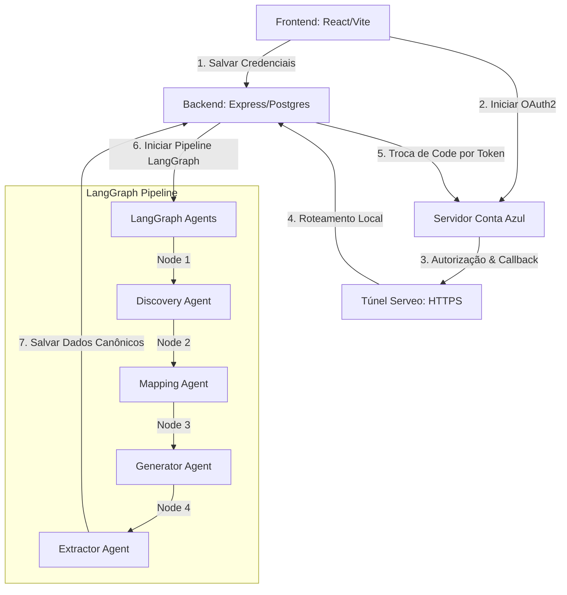

# Guia de Estudo: Integração OAuth2 & Pipeline de Agentes Inteligentes (ETL)

Este guia documenta detalhadamente todos os ajustes, correções de bugs e soluções de rede que implementamos para fazer a integração completa com a **Conta Azul** funcionar de ponta a ponta no seu ambiente de desenvolvimento.

Use este guia como material de estudo para entender os conceitos de **OAuth2**, **túneis seguros de rede**, e o funcionamento de **Pipelines baseados em LangGraph (IA)**.

---

## 🗺️ Visão Geral da Arquitetura
O sistema é um SaaS financeiro inteligente. Ele se conecta a ERPs externos para extrair dados (Notas Fiscais, Contas a Receber, Contas a Pagar e Clientes), mapeando-os para um modelo de dados unificado (Canônico).



---

## 1. O Fluxo de Autenticação OAuth2 da Conta Azul

### 💡 Conceito
O fluxo utilizado é o **Authorization Code Flow** (OAuth2). Ele permite que o sistema acesse os dados do cliente da Conta Azul sem que o cliente precise compartilhar a senha dele conosco.

1.  **Redirecionamento para Autorização:** O usuário clica em "Conectar via OAuth2" e é enviado para a Conta Azul.
2.  **Consentimento:** O usuário faz login na Conta Azul e autoriza o nosso aplicativo.
3.  **Callback:** A Conta Azul redireciona o navegador do usuário de volta para o nosso sistema com um parâmetro temporário chamado `code` na URL.
4.  **Troca de Token:** O nosso backend captura esse `code` e faz uma requisição nos bastidores (Server-to-Server) para trocar o código por um `access_token` (usado para fazer requisições) e um `refresh_token` (usado para renovar o acesso após 1 hora).

---

## 2. Ajuste 1: Compatibilidade do Localhost com o HTTPS (Frontend)
### 🔍 O Problema
O Portal de Desenvolvedor da Conta Azul é extremamente seguro e **proíbe o registro de URLs de redirecionamento que iniciem com `http://`** (exibindo o erro *"URL de redirecionamento inválida"* no formulário). Ele exige estritamente o uso de **`https://`**.

Porém, localmente, nosso servidor de desenvolvimento React/Vite roda em `http://localhost:3000`.

### 🛠️ A Solução
Modificamos o componente `client/src/pages/TenantDetail.tsx` para forçar o protocolo `https://` ao construir a URL de callback que é exibida na tela e enviada ao backend:

```diff
// client/src/pages/TenantDetail.tsx

     // Simpler: build redirectUri without nesting
-    const callbackUrl = `${window.location.origin}/api/oauth/conta-azul/callback`;
+    const callbackUrl = `${window.location.origin.replace("http://", "https://")}/api/oauth/conta-azul/callback`;
     const fullRedirectUri = `${callbackUrl}?tenantId=${tenantId}&redirectUri=${encodeURIComponent(callbackUrl)}`;
```

Isso permitiu cadastrar com sucesso no portal da Conta Azul:
`https://localhost:3000/api/oauth/conta-azul/callback`

---

## 3. Ajuste 2: Viabilização do Tráfego Seguro via Túnel (Serveo)
### 🔍 O Problema
Mesmo cadastrando `https://localhost:3000` no portal, quando a Conta Azul tentava redirecionar o usuário de volta, a conexão quebrava, porque seu computador local não possui um certificado digital SSL configurado para responder por HTTPS na porta `3000`. Além disso, a Conta Azul frequentemente bloqueia conexões diretas ao domínio `localhost` por regras rígidas de segurança corporativa.

### 🛠️ A Solução
Usamos o **Serveo**, um serviço de túnel reverso totalmente gratuito e baseado em SSH. Ao rodar no terminal:

```bash
ssh -R 80:localhost:3000 serveo.net
```

O Serveo criou um túnel reverso criptografado:
`https://d697d82a80447d9e-177-37-155-153.serveousercontent.com` ➔ `http://localhost:3000`

1.  Este novo endereço possui um **certificado SSL válido**, sendo aceito sem restrições pelo portal de desenvolvedor da Conta Azul.
2.  Ao acessar o sistema por este link seguro, todas as operações de login e redirecionamento de OAuth aconteceram de forma transparente e automática de ponta a ponta!

---

## 4. Ajuste 3: Correção do Bug de Escopo no Pipeline de Agentes (`ReferenceError`)
### 🔍 O Problema
Ao clicar em "Executar Extração", o sistema iniciava o pipeline de agentes inteligentes utilizando a biblioteca **LangGraph**. A execução falhava no último nó (`extractorNode`) com o seguinte erro:

```text
ReferenceError: discoveryResult is not defined
```

Ao inspecionarmos o arquivo `server/agentGraph.ts`, identificamos que a função auxiliar `extractContaAzulEntity` (responsável por buscar os dados reais da API da Conta Azul) tentava acessar a variável `discoveryResult` para descobrir os parâmetros corretos de paginação que a IA havia identificado na documentação:

```typescript
// O erro ocorria aqui:
...(discoveryResult?.paginationParams?.page ? { [discoveryResult.paginationParams.page]: page } : { pagina: page })
```

Porém, a variável `discoveryResult` **não estava definida no escopo da função**, pois ela não havia sido declarada como parâmetro e nem existia no escopo global do arquivo.

### 🛠️ A Solução
Fizemos uma refatoração cirúrgica no pipeline em duas partes:

1.  **Atualização da Assinatura da Função:** Adicionamos o parâmetro `discoveryResult` na definição da função `extractContaAzulEntity`:

```typescript
// server/agentGraph.ts
async function extractContaAzulEntity(
  credentials: Record<string, string>,
  entityType: EntityType,
  generatorResult: GeneratorResult,
  onBatch: (items: Record<string, unknown>[]) => Promise<void>,
  tenantId?: number,
  discoveryResult?: DiscoveryResult // <-- Injetado aqui!
): Promise<number> {
```

2.  **Injeção do Estado na Chamada:** No nó principal de extração (`extractorNode`), passamos o estado do Discovery coletado pelo LangGraph para a função:

```typescript
// server/agentGraph.ts
    try {
      if (erpType === "conta_azul") {
        await extractContaAzulEntity(credentials, entityType, generatorResult, processBatch, tenantId, state.discoveryResult); // <-- Passado aqui!
      } else {
        await extractOmieEntity(credentials, entityType, generatorResult, processBatch);
      }
```

---

## 5. Como o Pipeline de Agentes (LangGraph) funciona?
O pipeline de extração que você executou utiliza **LangGraph** para encadear tarefas cognitivas usando Modelos de Linguagem (LLMs):

### 🧠 Passo 1: Discovery (`discoveryNode`)
*   **O que faz:** Lê a URL de documentação fornecida ou cai em um fallback estático.
*   **Ação da IA:** Analisa o texto técnico da API para identificar o método de autenticação, endpoints suportados, como a paginação funciona e quais chaves envelopam os arrays de dados.

### 🗺️ Passo 2: Mapping (`mappingNode`)
*   **O que faz:** Cruza a estrutura de campos específicos da API do ERP (ex: `cliente.nome`, `cpf_cnpj`) com a nossa estrutura canônica padrão do banco de dados (ex: `customer_name`, `document`).
*   **Ação da IA:** Cria um dicionário dinâmico do tipo "De/Para" (`dePara`).

### ⚙️ Passo 3: Generator (`generatorNode`)
*   **O que faz:** Consolida as informações das fases de Discovery e Mapping para construir um plano de execução de baixo nível para o extrator.
*   **Ação da IA:** Define a estratégia exata de cabeçalhos de autenticação, formato dos parâmetros de data e paginação.

### 📥 Passo 4: Extractor (`extractorNode`)
*   **O que faz:** Executa as requisições HTTP reais de forma iterativa, paginando e consumindo os lotes de dados.
*   **Lógica:** Salva cada payload JSON bruto no armazenamento e converte as chaves do ERP em registros canônicos inserindo-os no Postgres local!

---

### 📝 Resumo dos Arquivos Envolvidos
*   **Frontend (UI do Tenant):** `client/src/pages/TenantDetail.tsx` *(Forçou protocolo HTTPS local)*
*   **Backend (OAuth2 Endpoints):** `server/contaAzulOAuthRoutes.ts` & `server/contaAzulOAuth.ts` *(Processaram o callback e tokens)*
*   **Pipeline de ETL IA:** `server/agentGraph.ts` *(Corrigiu o escopo de paginação no nó Extractor)*
